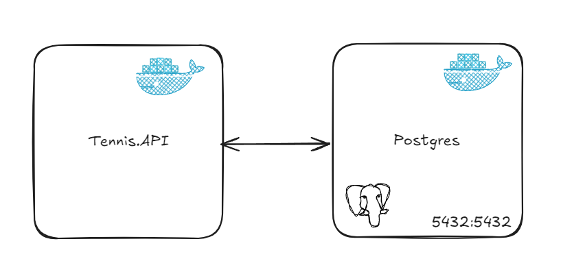

# Tennis Challenge

# Descripción  General
El Proyecto es una API REST en .NET 8 que simula un torneo de tenis por modalidad de eliminación directa.

# Ejecutar proyecto
1. Instalar **`Docker`**
2. Instalar  **`Visual Studio 2022`**
3. Ejecutar el proyecto en el perfil **`docker-compose`**
    - En caso de ejecutar normalmente por perfil https, modificar el connection string en el archivo **`appsettings.Development.json`** y que la misma apunte al servidor de postgres deseado.

# Arquitectura
El proyecto segue los principios de  Clen Architecture, estructurándose en la siguientes capas

1.  **`API`** El host de la aplicación (Punto de inicio) es independiente a toda lógica de aplicacion. limitándose a servir de host para la aplicación y a llamar las depedencias de otras capas.
2. **`Core`** La capa principal de la aplicación central, donde se encuentran las entidades, servicios de dominio, excepciones e interfaces de los repositorios. Normalmente esta capa se ve divida en varias subcapas (como `Domain` o `Shared`) pero por temas de simplicidad opté por unificarla.
3. **`Application`** Aqui se encuentran los casos de uso principales expuestos por la aplicación, también la declaración de los endpoints los cuales pueden ser consumidos mediante `HTTP`.
    - Implementé el patrón **`Command Query Responsability Segregation`** para separar las responsibilidades entre comandos y consultas.
4. **`Infrastructure`** Posee las implementaciones de las que se hará uso para hacer peticiones a la base de datos. También, se desarrollan herramientas útiles para la aplicación, como en este caso, un Middleware.
    -	Para la gestión de datos,  utilicé **`Entity Framework Core`** como ORM, haciendo uso de la técnica  **`Code First`**.
5. **`Test`** Donde se encuentran los test unitarios y de integración de la aplicación.
    - Opté por el uso de **`xUnit`** como framework de testing.
    - Para generar una base de datos dummy para los test de integración, utilicé **`TestContainers`**.





# Documentación  de la API
Se utiliza `Open Api` cómo protocolo para documentar la API lo cual  
nos permite exportar el manifiesto para luego ser importado en Redoc, Swagger los cuales se encuentra implementados.  
Para poder visualizar ingrese `/redoc` o `/swagger`

## Jugadores
Acciones referidas a los jugadores. Al momento no se expone una interfaz para crear uno, se utilizan los del seed inicial.

### Ver Jugadores
**`GET api/players`**

### Ver un jugador
**`GET api/players/{playerId:guid}`**

## Torneos
Acciones referidas a los torneos.
### Ver Torneos
**`GET api/tournaments`**

### Ver un Torneo
**`GET api/tournaments/{tournamentId:guid}`**
### Crear un Torneo
**`POST api/tournaments`**
> - **Las fechas de `comienzo` y `finalización` de los torneos deben ser válidas**
> - **El tipo de torneo debe corresponder con el género de los jugadores**
> - **Los jugadores no pueden estar asignados a otros torneos durante las fechas indicadas previamente.**

### Generar partidos de un torneo
**`PUT api/tournaments/matches/generate/{tournamentId:guid}`**
> - **El torneo debe tener jugadores asignados**
> - **El torneo no debe tener partidos asignados**
> - **El torneo tiene que estar vigente**

### Ver partidos de un torneo
**`GET api/tournaments/matches/{tournamentId:guid}`**


# Documentación Funcional

## ¿Cómo se generan los partidos?
Los partidos son generados entre los partidos a partir de la la lista de jugadores asignada. Vease como ejemplo la siguiente petición HTTP para la creación de un torneo.
```json
{
  "name": "ATP Open",
  "tournamentType": "Male",
  "startDate": "2024-11-10",
  "endDate": "2024-11-14",
  "playersIds": [
		"01416867-5fa7-406b-8509-5e00c0d95291",
		"02891735-bd59-4c05-b5bd-9e203ec8f45e",
		"4b9d627f-836e-4c43-954c-baaf1053a035",
		"8354cd01-71fa-47c2-a66f-6042ee0907ac"
  ]
}
```


## ¿Cómo se determina un ganador?

Se utiliza una técnica estadística llamada **distribución de pesos**. Esta técnica consiste en ponderar distintos atributos de un jugador, de modo que la suma de todas las ponderaciones dé como resultado 1, teniendo en cuenta que   **1 = 100%**

### Ejemplo:

```csharp 
var player = new MalePlayer(
    id: new Guid("01416867-5fa7-406b-8509-5e00c0d95291"),  
    name: "Liam O'Connor",  
    country: "Ireland",  
    level: 5,  
    age: 24,  
    gender: "Male",  
    force: 83,  
    velocity: 79,  
    wins: 27,  
    losses: 20
);
```
Para este jugador masculino, podemos calcular su **probabilidad de ganar** de la siguiente manera

```csharp 
public override int CalculateWinProbability()  
{  
    var statScore = (Force + Velocity) / 2;  // Promedio de estadísticas físicas, aplicable para el jugador masculino
    var historyScore = Wins - Losses;  // Diferencia entre victorias y derrotas
    var randomFactor = new Random().Next(0, 10);  // Factor de azar
  
    var winProbability = checked((int)(0.7 * statScore + 0.2 * historyScore + 0.1 * randomFactor));  
    return Math.Clamp(winProbability, 0, 100);  // Aseguramos que esté entre 0 y 100
}
```

### Desglose de la ecuación:

-   **Influencia de sus estadísticas personales (fuerza y velocidad)**: `0.7 = 70%`
-   **Influencia de su historial (victorias - derrotas)**: `0.2 = 20%`
-   **Influencia de un factor aleatorio (azar)**: `0.1 = 10%`

La ecuación quedaría

`0.7 * estadísticas + 0.2 * historial + 0.1 * azar = 1 = 100%`

### Aplicando el ejemplo:

Tomando los valores del ejemplo anterior

`0.7 * 81 + 0.2 * 7 + 0.1 * (0...10)`

> -   **Estadísticas (Force + Velocity) / 2** = (83 + 79) / 2 = **81**
> -   **Historial (Wins - Losses)** = 27 - 20 = **7**
> -   **Factor aleatorio** = un valor entre 0 y 10

Finalmente, tras obtener el valor resultante de la ecuación, **se compara con el de su oponente** para determinar quién es el **ganador**

## To Do
- Unit Testing
- Logging Implementation 
